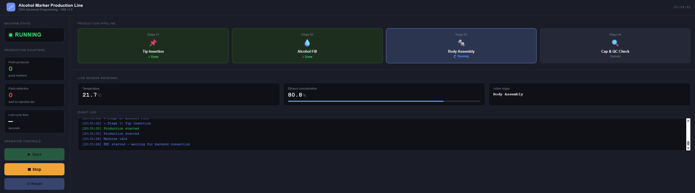
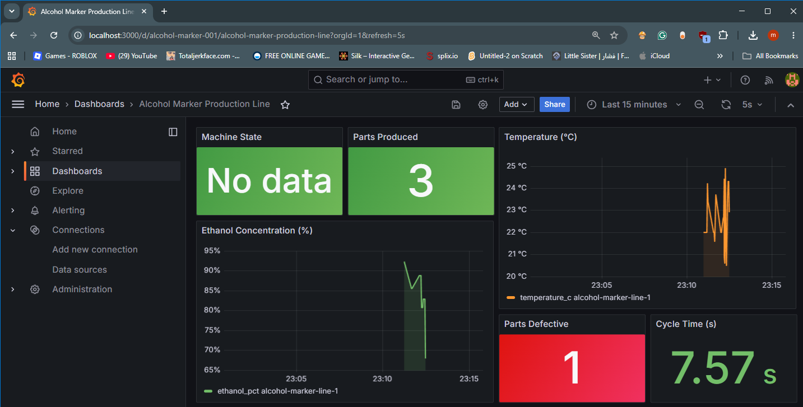

# Alcohol Marker Production Line Simulator

**A Simulated Four-Stage Manufacturing Line**

SRH Advanced Programming Project — Applied Mechatronics — June 2026

| | |
|---|---|
| **Document title** | `100006672_Ehab_AP` |
| **Author** | `Moaz Ehab` |
| **Student ID** | `100006672` |
| **Project website** | `https://moazehab510.github.io/alcohol-marker-sim/` |

> **Note:** the assignment deliverable is a **PDF** produced from the course
> `Project_Template`. This Markdown file is the working draft of that content —
> paste it into the template (or export it to PDF) and fill in the highlighted
> placeholders before submitting.

---

## Table of contents
1. [Introduction](#1-introduction)
2. [Program implementation](#2-program-implementation)
3. [Tools and version control](#3-tools-and-version-control)
4. [Conclusion](#4-conclusion)
- [Appendix A – Use of AI tools](#appendix-a--use-of-ai-tools)

---

## 1. Introduction

### 1.1 The product

This project implements a software simulation of a manufacturing production line
that assembles **alcohol-based ink markers**. An alcohol marker is a writing
instrument whose ink is dissolved in an alcohol solvent (typically ethanol), which
lets the ink dry quickly and blend smoothly. The product is built from four
distinct components, satisfying the assignment's minimum of four components:

- **Tip** — the polyester or felt nib that delivers ink to the writing surface.
- **Alcohol/ink fill** — the ethanol-based ink charged into the reservoir; its concentration is the key quality parameter.
- **Body** — the outer barrel that houses the ink reservoir.
- **Cap** — the closure that seals the tip and prevents the solvent from evaporating.

### 1.2 The production-line concept

The line is modelled as four sequential stages. Each stage performs one operation,
takes a realistic random cycle time, and may reject the part if a defect is
detected. A part must pass all four stages to count as a good marker; a failure at
any stage marks the part defective, records the reason, and faults the machine.

| # | Stage | Defect condition (why a part is rejected) |
|---|-------|-------------------------------------------|
| 1 | Tip Insertion | Nib holder misaligned – the tip is not properly seated (8% chance). |
| 2 | Alcohol Fill | Ethanol concentration below 70% or above 90% – outside the quality window. |
| 3 | Body Assembly | Barrel click-lock failed – the body is not fully seated (6% chance). |
| 4 | Cap & QC Check | Cap absent/loose or leak test failed (10% chance). |

The machine is governed by a finite-state machine (FSM) with three states:

```
IDLE  --[Start]-->  RUNNING  --[Defect]-->  FAULTED
  ^                    |                        |
  +----[Stop]----------+                        |
  +-------------------[Reset]-------------------+
```

It starts in **IDLE**. **Start** moves it to **RUNNING**, where it continuously
produces markers. If a stage detects a defect, it transitions to **FAULTED** and
stops, displaying the fault reason. **Reset** clears the condition, returning the
line to IDLE and resetting the counters.

---

## 2. Program implementation

The simulator follows a classic three-tier architecture, with every component
containerised and orchestrated by Docker Compose so the whole system starts with a
single command.

| Layer | Technology | Responsibility |
|-------|-----------|----------------|
| Backend / logic | Python 3.11, Flask | Runs the FSM and the four stages; exposes a REST API; writes telemetry. |
| Frontend / HMI | HTML, CSS, JavaScript | Operator panel: Start/Stop/Reset, live state, sensors, faults. |
| Database | InfluxDB 2.7 | Time-series storage of every machine snapshot. |
| Dashboard | Grafana 10.4 | Visualises the stored parameters in real time. |
| Orchestration | Docker Compose | Builds and runs all services on one network. |

### 2.1 Backend – logic and defect detection

The backend (`backend/main.py`) holds the machine state in a single dictionary
protected by a threading lock, so the production thread and the HTTP request
handlers never corrupt shared data. When the operator starts the line, a daemon
thread runs the production loop: for each marker it executes the four stages in
order. A stage is simulated by `run_stage()`, which sleeps for a realistic
duration, perturbs the ambient temperature, and applies the stage-specific defect
logic.

Crucially, the program states clearly **when and why** a product is defective.
Each stage returns a structured result with an `ok` flag and a human-readable
reason. For example, the alcohol-fill stage rejects a part outside the 70–90%
window with an explicit message:

```python
if ethanol < 70.0:  return {"ok": False, "reason": f"Ethanol too low ({ethanol}%) – minimum 70%"}
if ethanol > 90.0:  return {"ok": False, "reason": f"Ethanol too high ({ethanol}%) – maximum 90%"}
```

When any stage fails, the loop increments the defective-parts counter, stores the
fault reason, transitions the FSM to FAULTED, and stops. A marker that clears all
four stages increments the good-parts counter and records the cycle time.

| Method | Endpoint | Description |
|--------|----------|-------------|
| GET | `/status` | Returns the full machine snapshot as JSON (polled by the HMI). |
| POST | `/start` | IDLE → RUNNING; launches the production thread. |
| POST | `/stop` | RUNNING → IDLE; graceful stop. |
| POST | `/reset` | FAULTED → IDLE; clears the fault and resets counters. |

### 2.2 Frontend – the HMI

The operator interface (`frontend/index.html`) is a single self-contained HTML
page that polls `/status` once per second and renders the machine state. It
fulfils all HMI requirements:

- **Operator controls:** Start, Stop and Reset buttons, each enabled only in the state where it is valid.
- **Production state:** a colour-coded state badge (IDLE/RUNNING/FAULTED), a four-card stage pipeline showing the active stage, and live counters for good and defective parts.
- **Sensor readings:** temperature, ethanol concentration and the active stage, plus a scrolling event log.
- **Error display:** when the machine is FAULTED, a red fault panel shows the exact reason returned by the backend.


*Insert screenshot of the HMI here — `docs/img/hmi.png`.*

### 2.3 Database – InfluxDB

The backend writes a data point to InfluxDB after every stage and every state
change, and additionally on a continuous **telemetry heartbeat** (every two
seconds) so the dashboard always has fresh data even when the line is idle. Each
point uses the measurement `production`, a tag identifying the line, and one field
per parameter, timestamped in UTC. The parameters sent to the database are:

| Field | Meaning |
|-------|---------|
| `fsm_state` | Machine state string (IDLE / RUNNING / FAULTED). |
| `stage` | Currently active stage number (1–4, or 0 when idle). |
| `parts_produced` | Cumulative count of good markers. |
| `parts_defective` | Cumulative count of rejected markers. |
| `temperature_c` | Simulated process temperature in °C. |
| `ethanol_pct` | Alcohol concentration of the fill – the key quality parameter. |
| `cycle_time_s` | Time in seconds for the last complete marker. |

### 2.4 Dashboard – Grafana

Grafana is provisioned automatically from configuration files, so the InfluxDB
data source and the dashboard exist on first start with no manual setup. The
dashboard exceeds the assignment's minimum of one displayed parameter, presenting
six panels: machine state, parts produced, parts defective, cycle time, an
ethanol-concentration time series (with the 70–90% quality band highlighted), and
a temperature time series. Each panel queries the `production` measurement using
Flux and refreshes every five seconds.


*Insert screenshot of the Grafana dashboard here — `docs/img/grafana.png`.*

### 2.5 A debugging case study: the silent InfluxDB write

During development the database appeared to receive no data, yet the backend
reported no errors – the logs showed only the HTTP status requests. Investigation
revealed two compounding causes, a good illustration of disciplined debugging:

1. **Hidden output.** Python block-buffers stdout when it runs in a Docker
   container, so the `print()` diagnostics never reached the container log, while
   the web server's request log (which uses the `logging` module) did. This made
   every write message invisible and gave the false impression that writes were
   not happening.
2. **The real error.** Once logging was made unbuffered, the true error surfaced
   immediately: the code used `WritePrecision.SECONDS`, which does not exist in the
   InfluxDB client library (valid members are `NS, US, MS, S`). Every write was
   raising an exception that had previously been swallowed.

The fix was to set `PYTHONUNBUFFERED=1`, route messages through Python's `logging`
module (logging both successes and failures), and correct the constant to
`WritePrecision.S`. After the fix, a direct query against the `markers` bucket
confirmed all seven fields are stored and that Grafana renders them live.

---

## 3. Tools and version control

### 3.1 Git and GitHub

The project is managed as a **single Git repository** containing all components
(backend, frontend, Grafana provisioning, the Docker Compose file and the project
website). A single repository is the natural choice because the entire stack is
wired together by one `docker-compose.yml` that references the sub-folders by
relative path; splitting the parts into separate repositories would break the
one-command start-up and the single-link submission. Git was used to track changes
incrementally with descriptive commit messages, following the standard
add → commit cycle taught in the course.

### 3.2 Docker and Docker Compose

Each service runs in its own container. The backend has a small Dockerfile based on
`python:3.11-slim`; InfluxDB and Grafana use official images. `docker-compose.yml`
defines the three services, their ports (5000 backend, 8086 InfluxDB, 3000
Grafana), a shared network, named volumes for data persistence, and a health check
so the backend and Grafana start only once InfluxDB is ready. The whole environment
is reproduced on any machine with a single command:

```bash
docker compose up --build
```

### 3.3 AI tools

Claude (Anthropic) was used as a programming assistant during development – most
notably to diagnose the silent InfluxDB write described in section 2.5. The most
relevant prompt, the assistant's response, and the corrections applied are
documented in Appendix A, as required. The benefits and limitations are discussed
there and in the conclusion.

### 3.4 Project website

The project is published as a website (GitHub Pages) that describes what the
simulator does, shows screenshots of the HMI and the Grafana dashboard, and links
to the source repository. The site is available at `https://moazehab510.github.io/alcohol-marker-sim/`.

---

## 4. Conclusion

The simulator meets all the core requirements: a Python backend with clear defect
detection, an HMI with start/stop/reset controls and fault display, an InfluxDB
time-series database, and a live Grafana dashboard, all reproducible through Docker
Compose.

### 4.1 Strengths
- Clean separation of concerns: the backend is the single source of truth and the HMI is purely a view, which made the data path easy to reason about and debug.
- Realistic, explainable defects: every rejection carries a human-readable reason shown on the HMI and stored in the database.
- Fully reproducible: one command brings up the whole stack with the dashboard pre-provisioned.

### 4.2 Weaknesses
- The machine state lives in memory, so counters reset when the backend restarts; only the time-series history in InfluxDB survives.
- A single production line with no authentication on the API; anyone who can reach the port can control the machine.
- Defect rates and timings are random rather than driven by a physical or data-based model.

### 4.3 Future development
- Implement the optional course modules: Quality Control (e.g. vision-based inspection), CMMS (maintenance scheduling) and SCADA-style supervision.
- Add Overall Equipment Effectiveness (OEE = Availability × Performance × Quality) and SEMI E10 equipment states for richer analytics.
- Support multiple parallel lines and persist machine state to the database.

### 4.4 Operational considerations
Operating such a solution in practice introduces requirements beyond the simulation
itself: continuous uptime and health monitoring, a data-retention and back-up policy
for the time-series database, access control and authentication on the control API,
alerting when the line faults, and a maintenance process for the containers and
their dependencies. These non-functional requirements are as important as the
functional behaviour when a line runs continuously in production.

---

## Appendix A – Use of AI tools

This appendix documents the use of AI assistance, as required by the assignment.

### A.1 Prompt

> "I'm building an alcohol marker production line simulator (Python/Flask backend,
> HTML HMI, InfluxDB, Grafana, Docker Compose). Everything runs fine except InfluxDB
> is not receiving data from the backend – the write is silently failing. The backend
> logs only show GET /status 200 requests, no InfluxDB write confirmations. Please
> help me debug why the backend isn't writing to InfluxDB."

### A.2 AI output (summary)

The assistant inspected the backend, Dockerfile and Compose file and identified two
issues. First, that Python block-buffers stdout under Docker, so `print()`
diagnostics never reached the logs while the web server's request log did –
explaining why only `GET /status` appeared. Second, after making logging
unbuffered, that the real failure was the use of a non-existent constant,
`WritePrecision.SECONDS`. It recommended setting `PYTHONUNBUFFERED=1`, switching to
the `logging` module with success and failure messages, and changing the constant
to `WritePrecision.S`.

### A.3 Corrections and verification

The suggested changes were applied and then **verified** rather than trusted
blindly: the stack was rebuilt, production was started, and the backend logs were
confirmed to show "Influx write OK" messages. A direct Flux query against the
`markers` bucket confirmed all seven fields were actually stored. This step was
important – the first diagnosis (buffering) was correct but incomplete, and only
running the system revealed the second, underlying bug.

### A.4 Benefits and limitations

The main benefit of the AI tool was **speed of diagnosis**: it correctly reasoned
about an environment-specific behaviour (Docker stdout buffering) that masked the
underlying error, and proposed a concrete, minimal fix. It also improved code
quality by replacing ad-hoc `print()` calls with structured logging. The key
limitation is that the AI's first explanation, although correct, did not by itself
fix the data flow; the actual bug only became visible after applying the logging
change and running the system. The lesson is that AI assistance is most effective
when its suggestions are **verified empirically** rather than accepted as complete.
